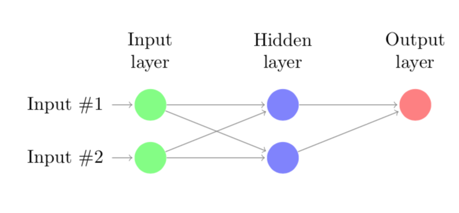
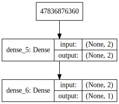

Deep learning (DL) is a thriving research field with an increasing number of practical applications. One of the models used in DL are so called artificial neural networks (ANN). In this tutorial I will not discuss exactly how these ANNs work, but instead I will show how flexible these models can be by training an ANN that will act as a XOR logic gate. 

## XOR gate

For those of you unfamiliar with logical gates, a logical gate takes two binary values as inputs and produces a single binary output. For the XOR gate it will output a 1 one value if only one of the input values is 1, and 0 otherwise, i.e., graphically:

|Input 1|Input 2|Output|
|-------|-------|------|
|   0   |   0   |   0  |
|   1   |   0   |   1  |
|   0   |   1   |   1  |
|   1   |   1   |   0  |


### XOR gate as ANN

[GoodFellow et al.](https://www.deeplearningbook.org) show that this XOR gate can be learned by an ANN with one hidden layer consisting of two neurons. We have two input neurons, one hidden layer and an output layer with a single neuron. This network can be graphically represented as:



When I started learning about Deep Learning and these ANN in particular I started wondering whether I could train the small ANN to learn to act like an XOR gate. Since I am still relatively new to these networks I thought it would be a good exercise to program the backpropagation algorithm that trains these models myself. 

## The network in Python

I decided to model this network in Python, since it is the most popular language for Deep Learning because of the active development of packages like `numpy`, `tensorflow`, `keras`, etc. As I will show below it is very easy to implement the model as described above and train it using a package like `keras`. However, since I wanted to get a better understanding of the backpropagation algorithm I decided to first implement this algorithm.

Before we start doing that let us first define the four possible combinations of inputs and corresponding outputs, i.e.,

$$
\boldsymbol{X} = \begin{bmatrix}
    0 & 0 \\
    1 & 0 \\
    0 & 1 \\
    1 & 1 
\end{bmatrix}, \quad \boldsymbol{y} = \begin{bmatrix}
0 \\
1 \\
1 \\
0
\end{bmatrix}
$$

In python we get


```python
import numpy as np

# Possible outputs
X = np.matrix('0 0; 1 0; 0 1; 1 1')
y = np.array([0, 1, 1, 0])
```

### Own implementation backpropagation algorithm

From this moment onwards I assume that you have a basic understanding of how an ANN works, and understand the basic math behind it. First, I will define some functions that are needed to implement the backpropagation algorithm to solve this problem.


```python
def relu(z):
    """ReLU activation function"""
    return np.maximum(z, 0, z)

def relu_prime(z):
    """First derivative of the ReLU activation function"""
    return 1*(z>0)

def sigmoid(z):
    """Sigmoid activation function"""
    return 1 / (1 + np.exp(-z))

def sigmoid_prime(z):
    """First derivative of sigmoid activation function"""
    return np.multiply(sigmoid(z), 1-sigmoid(z))

def cost(a, y):
    """Calculate MSE"""
    return ((a - y) ** 2).mean()

def cost_grad(a, y):
    """First derivate of MSE function"""
    return a - y

def weighted_sum(W, a, b):
    """Compute the weighted average z for all neurons in new layer"""
    return W.dot(a) + b

def forward_prop(x, W, b): 
    """Calculate z and a for every neuron using current weights and biases"""
    a = [None] * len(layer_sizes)
    z = [None] * len(layer_sizes)
    
    a[0] = x.T
    
    for l in range(1, len(a)):
        z[l] = weighted_sum(W[l], a[l-1], b[l])
        a[l] = sigmoid(z[l])
        
    return (a, z)

def back_prop(a, z, W, y):
    """Calculate error delta for every neuron"""
    delta = [None] * len(layer_sizes)
    end_node = len(a)-1
    
    delta[end_node] = np.multiply(cost_grad(a[end_node], y), sigmoid_prime(z[end_node]))
    
    for l in reversed(range(1, end_node)):
        delta[l] = np.multiply(W[l+1].T.dot(delta[l+1]), sigmoid_prime(z[l]))
    
    return delta

def calc_gradient(W, b, a, delta, eta):
    """Update W and b using gradient descent steps based"""
    W_grad = [None] * len(W)
    b_grad = [None] * len(b)
    
    for l in range(1, len(W)):
        W_grad[l] = a[l-1].dot(delta[l].T)
        b_grad[l] = delta[l]
    
    return (W_grad, b_grad)

def backpropagation_iter(X, y, W, b, eta):
    """One iteration of the backpropagation algorithm, i.e., forward- and backward propagate and compute gradient"""
    y_pred = [None] * len(y)
    
    for i in range(n):
        # First we propagate forward through the network to obtain activation levels and z.
        a, z = forward_prop(X[i, :], W, b)
        y_pred[i] = np.max(a[-1])

        # Back propagate to obtain delta's.
        delta = back_prop(a, z, W, y[i])

        # This allows us to compute the gradient for this instance. Add this to all.
        W_grad, b_grad = calc_gradient(W, b, a, delta, eta)

        if i == 0:
            W_grad_sum = W_grad
            b_grad_sum = b_grad
        else:
            for l in range(1, len(W_grad)):
                W_grad_sum[l] += W_grad[l]
                b_grad_sum[l] += b_grad[l]

    # Update weights and bias
    for l in range(1, len(W)):
        W[l] = W[l] - (eta/n) * W_grad_sum[l]
        b[l] = b[l] - (eta/n) * b_grad_sum[l]
    
    # Show MSE
    MSE = cost(y_pred, y)
    
    return (W, b, y_pred, MSE)
```

We also need to initialise the weights and bias of every link and neuron. It is important to do this randomly. We also set the number of iterations and the learning rate for the gradient descent method.


```python
# Initialise layer sizes of all layers in the neural network
layer_sizes = [X.shape[1], 2, 1]

# Initialise weights and activation and weight vectors as None.
W = [None] * len(layer_sizes)
b = [None] * len(layer_sizes)

# Initialise weights randomly
for l in range(1, len(layer_sizes)):
    W[l] = np.random.random((layer_sizes[l], layer_sizes[l-1]))
    b[l] = np.random.random((layer_sizes[l], 1))
    
# Set number of iterations for backpropagation to work, size, and learning rate
n_iter = 100
n = X.shape[0]
eta = 0.1
```

Below we run our backpropagation algorithm for 100 iterations. For every iteration we display the MSE error of the ANN. Interestingly, we observe that the MSE first drops rapidly, but the MSE does not converge to zero. In other words, the training as described above does not lead to a perfect XOR gate; it can only classify 3 pair of inputs correctly.


```python
for iter in range(n_iter+1):
    W, b, y_pred, MSE = backpropagation_iter(X, y, W, b, eta)
    
    # Only print every 10 iterations
    if iter % 10 == 0:
        print('Iteration {0}: {1}'.format(iter, MSE))
```

    Iteration 0: 0.38656561971217596
    Iteration 10: 0.37967674088143133
    Iteration 20: 0.37237614217772685
    Iteration 30: 0.3647250789164269
    Iteration 40: 0.3567771690665022
    Iteration 50: 0.34860542693257024
    Iteration 60: 0.3403016700706688
    Iteration 70: 0.33197373064753966
    Iteration 80: 0.32374029713366215
    Iteration 90: 0.3157236870674678
    Iteration 100: 0.30804138226491107


### Keras implementation

Above I showed how to implement the backpropagation algorithm in python. Below, I will show how to implement the same model using the keras library.


```python
from keras.models import Sequential
from keras.layers import Dense
from IPython.display import SVG
from keras.utils.vis_utils import model_to_dot

model = Sequential()

model.add(Dense(units=2, activation='relu', input_dim=2))
model.add(Dense(units=1, activation='linear'))

model.compile(loss='mean_squared_error',
              optimizer='sgd',
              metrics=['accuracy'])

model.fit(X, y, epochs=300, batch_size=4)

SVG(model_to_dot(model, show_shapes=True).create(prog='dot', format='svg'))
```

    Epoch 1/300
    4/4 [==============================] - 0s 37ms/step - loss: 0.6039 - acc: 0.7500
    Epoch 2/300
    4/4 [==============================] - 0s 252us/step - loss: 0.5813 - acc: 0.7500
    Epoch 3/300
    4/4 [==============================] - 0s 301us/step - loss: 0.5615 - acc: 0.7500
    Epoch 4/300
    4/4 [==============================] - 0s 398us/step - loss: 0.5441 - acc: 0.7500
    Epoch 5/300
    4/4 [==============================] - 0s 415us/step - loss: 0.5287 - acc: 0.7500
    Epoch 6/300
    4/4 [==============================] - 0s 246us/step - loss: 0.5150 - acc: 0.7500
    Epoch 7/300
    4/4 [==============================] - 0s 257us/step - loss: 0.5028 - acc: 0.7500
    Epoch 8/300
    4/4 [==============================] - 0s 269us/step - loss: 0.4919 - acc: 0.7500
    Epoch 9/300
    4/4 [==============================] - 0s 349us/step - loss: 0.4822 - acc: 0.7500
    Epoch 10/300
    4/4 [==============================] - 0s 272us/step - loss: 0.4734 - acc: 0.7500
    Epoch 11/300
    4/4 [==============================] - 0s 247us/step - loss: 0.4655 - acc: 0.7500
    Epoch 12/300
    4/4 [==============================] - 0s 291us/step - loss: 0.4583 - acc: 0.7500
    Epoch 13/300
    4/4 [==============================] - 0s 291us/step - loss: 0.4518 - acc: 0.5000
    Epoch 14/300
    4/4 [==============================] - 0s 330us/step - loss: 0.4458 - acc: 0.5000
    Epoch 15/300
    4/4 [==============================] - 0s 236us/step - loss: 0.4404 - acc: 0.5000
    Epoch 16/300
    4/4 [==============================] - 0s 316us/step - loss: 0.4354 - acc: 0.5000
    Epoch 17/300
    4/4 [==============================] - 0s 279us/step - loss: 0.4308 - acc: 0.5000
    Epoch 18/300
    4/4 [==============================] - 0s 255us/step - loss: 0.4266 - acc: 0.5000
    Epoch 19/300
    4/4 [==============================] - 0s 269us/step - loss: 0.4227 - acc: 0.5000
    Epoch 20/300
    4/4 [==============================] - 0s 275us/step - loss: 0.4190 - acc: 0.5000
    Epoch 21/300
    4/4 [==============================] - 0s 433us/step - loss: 0.4157 - acc: 0.5000
    Epoch 22/300
    4/4 [==============================] - 0s 389us/step - loss: 0.4125 - acc: 0.5000
    Epoch 23/300
    4/4 [==============================] - 0s 285us/step - loss: 0.4095 - acc: 0.5000
    Epoch 24/300
    4/4 [==============================] - 0s 257us/step - loss: 0.4068 - acc: 0.5000
    Epoch 25/300
    4/4 [==============================] - 0s 345us/step - loss: 0.4041 - acc: 0.5000
    Epoch 26/300
    4/4 [==============================] - 0s 281us/step - loss: 0.4017 - acc: 0.5000
    Epoch 27/300
    4/4 [==============================] - 0s 282us/step - loss: 0.3993 - acc: 0.5000
    Epoch 28/300
    4/4 [==============================] - 0s 265us/step - loss: 0.3971 - acc: 0.5000
    Epoch 29/300
    4/4 [==============================] - 0s 272us/step - loss: 0.3950 - acc: 0.5000
    Epoch 30/300
    4/4 [==============================] - 0s 298us/step - loss: 0.3930 - acc: 0.5000
    Epoch 31/300
    4/4 [==============================] - 0s 412us/step - loss: 0.3910 - acc: 0.5000
    Epoch 32/300
    4/4 [==============================] - 0s 243us/step - loss: 0.3892 - acc: 0.5000
    Epoch 33/300
    4/4 [==============================] - 0s 298us/step - loss: 0.3874 - acc: 0.5000
    Epoch 34/300
    4/4 [==============================] - 0s 286us/step - loss: 0.3857 - acc: 0.5000
    Epoch 35/300
    4/4 [==============================] - 0s 408us/step - loss: 0.3841 - acc: 0.5000
    Epoch 36/300
    4/4 [==============================] - 0s 223us/step - loss: 0.3825 - acc: 0.5000
    Epoch 37/300
    4/4 [==============================] - 0s 327us/step - loss: 0.3809 - acc: 0.5000
    Epoch 38/300
    4/4 [==============================] - 0s 251us/step - loss: 0.3794 - acc: 0.5000
    Epoch 39/300
    4/4 [==============================] - 0s 257us/step - loss: 0.3780 - acc: 0.2500
    Epoch 40/300
    4/4 [==============================] - 0s 321us/step - loss: 0.3766 - acc: 0.2500
    Epoch 41/300
    4/4 [==============================] - 0s 261us/step - loss: 0.3752 - acc: 0.2500
    Epoch 42/300
    4/4 [==============================] - 0s 301us/step - loss: 0.3739 - acc: 0.2500
    Epoch 43/300
    4/4 [==============================] - 0s 213us/step - loss: 0.3726 - acc: 0.2500
    Epoch 44/300
    4/4 [==============================] - 0s 280us/step - loss: 0.3713 - acc: 0.2500
    Epoch 45/300
    4/4 [==============================] - 0s 249us/step - loss: 0.3701 - acc: 0.2500
    Epoch 46/300
    4/4 [==============================] - 0s 306us/step - loss: 0.3689 - acc: 0.2500
    Epoch 47/300
    4/4 [==============================] - 0s 313us/step - loss: 0.3677 - acc: 0.2500
    Epoch 48/300
    4/4 [==============================] - 0s 229us/step - loss: 0.3665 - acc: 0.2500
    Epoch 49/300
    4/4 [==============================] - 0s 397us/step - loss: 0.3653 - acc: 0.2500
    Epoch 50/300
    4/4 [==============================] - 0s 244us/step - loss: 0.3642 - acc: 0.2500
    Epoch 51/300
    4/4 [==============================] - 0s 280us/step - loss: 0.3631 - acc: 0.2500
    Epoch 52/300
    4/4 [==============================] - 0s 275us/step - loss: 0.3620 - acc: 0.2500
    Epoch 53/300
    4/4 [==============================] - 0s 284us/step - loss: 0.3610 - acc: 0.2500
    Epoch 54/300
    4/4 [==============================] - 0s 308us/step - loss: 0.3599 - acc: 0.2500
    Epoch 55/300
    4/4 [==============================] - 0s 225us/step - loss: 0.3589 - acc: 0.2500
    Epoch 56/300
    4/4 [==============================] - 0s 274us/step - loss: 0.3578 - acc: 0.2500
    Epoch 57/300
    4/4 [==============================] - 0s 279us/step - loss: 0.3568 - acc: 0.2500
    Epoch 58/300
    4/4 [==============================] - 0s 319us/step - loss: 0.3558 - acc: 0.2500
    Epoch 59/300
    4/4 [==============================] - 0s 309us/step - loss: 0.3549 - acc: 0.2500
    Epoch 60/300
    4/4 [==============================] - 0s 306us/step - loss: 0.3539 - acc: 0.2500
    Epoch 61/300
    4/4 [==============================] - 0s 261us/step - loss: 0.3529 - acc: 0.2500
    Epoch 62/300
    4/4 [==============================] - 0s 382us/step - loss: 0.3520 - acc: 0.2500
    Epoch 63/300
    4/4 [==============================] - 0s 229us/step - loss: 0.3511 - acc: 0.2500
    Epoch 64/300
    4/4 [==============================] - 0s 335us/step - loss: 0.3501 - acc: 0.2500
    Epoch 65/300
    4/4 [==============================] - 0s 242us/step - loss: 0.3492 - acc: 0.2500
    Epoch 66/300
    4/4 [==============================] - 0s 364us/step - loss: 0.3483 - acc: 0.2500
    Epoch 67/300
    4/4 [==============================] - 0s 292us/step - loss: 0.3474 - acc: 0.2500
    Epoch 68/300
    4/4 [==============================] - 0s 282us/step - loss: 0.3466 - acc: 0.2500
    Epoch 69/300
    4/4 [==============================] - 0s 392us/step - loss: 0.3457 - acc: 0.2500
    Epoch 70/300
    4/4 [==============================] - 0s 416us/step - loss: 0.3448 - acc: 0.2500
    Epoch 71/300
    4/4 [==============================] - 0s 238us/step - loss: 0.3440 - acc: 0.2500
    Epoch 72/300
    4/4 [==============================] - 0s 438us/step - loss: 0.3431 - acc: 0.2500
    Epoch 73/300
    4/4 [==============================] - 0s 243us/step - loss: 0.3423 - acc: 0.2500
    Epoch 74/300
    4/4 [==============================] - 0s 233us/step - loss: 0.3415 - acc: 0.2500
    Epoch 75/300
    4/4 [==============================] - 0s 268us/step - loss: 0.3407 - acc: 0.2500
    Epoch 76/300
    4/4 [==============================] - 0s 267us/step - loss: 0.3399 - acc: 0.2500
    Epoch 77/300
    4/4 [==============================] - 0s 261us/step - loss: 0.3391 - acc: 0.2500
    Epoch 78/300
    4/4 [==============================] - 0s 252us/step - loss: 0.3383 - acc: 0.2500
    Epoch 79/300
    4/4 [==============================] - 0s 275us/step - loss: 0.3375 - acc: 0.2500
    Epoch 80/300
    4/4 [==============================] - 0s 233us/step - loss: 0.3367 - acc: 0.2500
    Epoch 81/300
    4/4 [==============================] - 0s 463us/step - loss: 0.3360 - acc: 0.2500
    Epoch 82/300
    4/4 [==============================] - 0s 350us/step - loss: 0.3352 - acc: 0.2500
    Epoch 83/300
    4/4 [==============================] - 0s 271us/step - loss: 0.3345 - acc: 0.2500
    Epoch 84/300
    4/4 [==============================] - 0s 271us/step - loss: 0.3337 - acc: 0.2500
    Epoch 85/300
    4/4 [==============================] - 0s 234us/step - loss: 0.3330 - acc: 0.2500
    Epoch 86/300
    4/4 [==============================] - 0s 242us/step - loss: 0.3323 - acc: 0.2500
    Epoch 87/300
    4/4 [==============================] - 0s 303us/step - loss: 0.3316 - acc: 0.2500
    Epoch 88/300
    4/4 [==============================] - 0s 382us/step - loss: 0.3309 - acc: 0.2500
    Epoch 89/300
    4/4 [==============================] - 0s 233us/step - loss: 0.3302 - acc: 0.2500
    Epoch 90/300
    4/4 [==============================] - 0s 312us/step - loss: 0.3295 - acc: 0.2500
    Epoch 91/300
    4/4 [==============================] - 0s 288us/step - loss: 0.3288 - acc: 0.2500
    Epoch 92/300
    4/4 [==============================] - 0s 254us/step - loss: 0.3282 - acc: 0.2500
    Epoch 93/300
    4/4 [==============================] - 0s 300us/step - loss: 0.3275 - acc: 0.2500
    Epoch 94/300
    4/4 [==============================] - 0s 248us/step - loss: 0.3269 - acc: 0.2500
    Epoch 95/300
    4/4 [==============================] - 0s 275us/step - loss: 0.3262 - acc: 0.2500
    Epoch 96/300
    4/4 [==============================] - 0s 230us/step - loss: 0.3256 - acc: 0.2500
    Epoch 97/300
    4/4 [==============================] - 0s 340us/step - loss: 0.3249 - acc: 0.2500
    Epoch 98/300
    4/4 [==============================] - 0s 279us/step - loss: 0.3243 - acc: 0.2500
    Epoch 99/300
    4/4 [==============================] - 0s 255us/step - loss: 0.3237 - acc: 0.2500
    Epoch 100/300
    4/4 [==============================] - 0s 296us/step - loss: 0.3231 - acc: 0.2500
    Epoch 101/300
    4/4 [==============================] - 0s 259us/step - loss: 0.3225 - acc: 0.2500
    Epoch 102/300
    4/4 [==============================] - 0s 251us/step - loss: 0.3219 - acc: 0.2500
    Epoch 103/300
    4/4 [==============================] - 0s 377us/step - loss: 0.3213 - acc: 0.2500
    Epoch 104/300
    4/4 [==============================] - 0s 293us/step - loss: 0.3207 - acc: 0.2500
    Epoch 105/300
    4/4 [==============================] - 0s 359us/step - loss: 0.3201 - acc: 0.2500
    Epoch 106/300
    4/4 [==============================] - 0s 260us/step - loss: 0.3196 - acc: 0.2500
    Epoch 107/300
    4/4 [==============================] - 0s 341us/step - loss: 0.3190 - acc: 0.2500
    Epoch 108/300
    4/4 [==============================] - 0s 305us/step - loss: 0.3184 - acc: 0.2500
    Epoch 109/300
    4/4 [==============================] - 0s 414us/step - loss: 0.3179 - acc: 0.2500
    Epoch 110/300
    4/4 [==============================] - 0s 248us/step - loss: 0.3173 - acc: 0.2500
    Epoch 111/300
    4/4 [==============================] - 0s 298us/step - loss: 0.3168 - acc: 0.2500
    Epoch 112/300
    4/4 [==============================] - 0s 392us/step - loss: 0.3162 - acc: 0.2500
    Epoch 113/300
    4/4 [==============================] - 0s 286us/step - loss: 0.3157 - acc: 0.2500
    Epoch 114/300
    4/4 [==============================] - 0s 243us/step - loss: 0.3152 - acc: 0.2500
    Epoch 115/300
    4/4 [==============================] - 0s 335us/step - loss: 0.3147 - acc: 0.2500
    Epoch 116/300
    4/4 [==============================] - 0s 259us/step - loss: 0.3141 - acc: 0.2500
    Epoch 117/300
    4/4 [==============================] - 0s 373us/step - loss: 0.3136 - acc: 0.2500
    Epoch 118/300
    4/4 [==============================] - 0s 401us/step - loss: 0.3131 - acc: 0.2500
    Epoch 119/300
    4/4 [==============================] - 0s 314us/step - loss: 0.3126 - acc: 0.2500
    Epoch 120/300
    4/4 [==============================] - 0s 302us/step - loss: 0.3121 - acc: 0.2500
    Epoch 121/300
    4/4 [==============================] - 0s 290us/step - loss: 0.3116 - acc: 0.2500
    Epoch 122/300
    4/4 [==============================] - 0s 346us/step - loss: 0.3112 - acc: 0.2500
    Epoch 123/300
    4/4 [==============================] - 0s 330us/step - loss: 0.3107 - acc: 0.2500
    Epoch 124/300
    4/4 [==============================] - 0s 354us/step - loss: 0.3102 - acc: 0.2500
    Epoch 125/300
    4/4 [==============================] - 0s 287us/step - loss: 0.3097 - acc: 0.2500
    Epoch 126/300
    4/4 [==============================] - 0s 335us/step - loss: 0.3093 - acc: 0.2500
    Epoch 127/300
    4/4 [==============================] - 0s 366us/step - loss: 0.3088 - acc: 0.2500
    Epoch 128/300
    4/4 [==============================] - 0s 319us/step - loss: 0.3083 - acc: 0.2500
    Epoch 129/300
    4/4 [==============================] - 0s 324us/step - loss: 0.3079 - acc: 0.2500
    Epoch 130/300
    4/4 [==============================] - 0s 284us/step - loss: 0.3074 - acc: 0.2500
    Epoch 131/300
    4/4 [==============================] - 0s 358us/step - loss: 0.3070 - acc: 0.2500
    Epoch 132/300
    4/4 [==============================] - 0s 415us/step - loss: 0.3066 - acc: 0.2500
    Epoch 133/300
    4/4 [==============================] - 0s 336us/step - loss: 0.3061 - acc: 0.2500
    Epoch 134/300
    4/4 [==============================] - 0s 895us/step - loss: 0.3057 - acc: 0.2500
    Epoch 135/300
    4/4 [==============================] - 0s 435us/step - loss: 0.3053 - acc: 0.2500
    Epoch 136/300
    4/4 [==============================] - 0s 457us/step - loss: 0.3048 - acc: 0.2500
    Epoch 137/300
    4/4 [==============================] - 0s 337us/step - loss: 0.3044 - acc: 0.2500
    Epoch 138/300
    4/4 [==============================] - 0s 294us/step - loss: 0.3040 - acc: 0.2500
    Epoch 139/300
    4/4 [==============================] - 0s 288us/step - loss: 0.3036 - acc: 0.2500
    Epoch 140/300
    4/4 [==============================] - 0s 304us/step - loss: 0.3032 - acc: 0.2500
    Epoch 141/300
    4/4 [==============================] - 0s 253us/step - loss: 0.3028 - acc: 0.2500
    Epoch 142/300
    4/4 [==============================] - 0s 406us/step - loss: 0.3024 - acc: 0.2500
    Epoch 143/300
    4/4 [==============================] - 0s 418us/step - loss: 0.3020 - acc: 0.2500
    Epoch 144/300
    4/4 [==============================] - 0s 267us/step - loss: 0.3016 - acc: 0.2500
    Epoch 145/300
    4/4 [==============================] - 0s 234us/step - loss: 0.3012 - acc: 0.2500
    Epoch 146/300
    4/4 [==============================] - 0s 298us/step - loss: 0.3008 - acc: 0.2500
    Epoch 147/300
    4/4 [==============================] - 0s 278us/step - loss: 0.3004 - acc: 0.2500
    Epoch 148/300
    4/4 [==============================] - 0s 287us/step - loss: 0.3001 - acc: 0.2500
    Epoch 149/300
    4/4 [==============================] - 0s 322us/step - loss: 0.2997 - acc: 0.2500
    Epoch 150/300
    4/4 [==============================] - 0s 263us/step - loss: 0.2993 - acc: 0.2500
    Epoch 151/300
    4/4 [==============================] - 0s 371us/step - loss: 0.2989 - acc: 0.2500
    Epoch 152/300
    4/4 [==============================] - 0s 322us/step - loss: 0.2986 - acc: 0.2500
    Epoch 153/300
    4/4 [==============================] - 0s 546us/step - loss: 0.2982 - acc: 0.2500
    Epoch 154/300
    4/4 [==============================] - 0s 286us/step - loss: 0.2979 - acc: 0.2500
    Epoch 155/300
    4/4 [==============================] - 0s 292us/step - loss: 0.2975 - acc: 0.2500
    Epoch 156/300
    4/4 [==============================] - 0s 329us/step - loss: 0.2972 - acc: 0.2500
    Epoch 157/300
    4/4 [==============================] - 0s 396us/step - loss: 0.2968 - acc: 0.2500
    Epoch 158/300
    4/4 [==============================] - 0s 452us/step - loss: 0.2965 - acc: 0.2500
    Epoch 159/300
    4/4 [==============================] - 0s 305us/step - loss: 0.2961 - acc: 0.2500
    Epoch 160/300
    4/4 [==============================] - 0s 260us/step - loss: 0.2958 - acc: 0.2500
    Epoch 161/300
    4/4 [==============================] - 0s 441us/step - loss: 0.2955 - acc: 0.2500
    Epoch 162/300
    4/4 [==============================] - 0s 330us/step - loss: 0.2951 - acc: 0.2500
    Epoch 163/300
    4/4 [==============================] - 0s 373us/step - loss: 0.2948 - acc: 0.2500
    Epoch 164/300
    4/4 [==============================] - 0s 405us/step - loss: 0.2945 - acc: 0.2500
    Epoch 165/300
    4/4 [==============================] - 0s 328us/step - loss: 0.2941 - acc: 0.2500
    Epoch 166/300
    4/4 [==============================] - 0s 422us/step - loss: 0.2938 - acc: 0.2500
    Epoch 167/300
    4/4 [==============================] - 0s 283us/step - loss: 0.2935 - acc: 0.2500
    Epoch 168/300
    4/4 [==============================] - 0s 337us/step - loss: 0.2932 - acc: 0.2500
    Epoch 169/300
    4/4 [==============================] - 0s 536us/step - loss: 0.2929 - acc: 0.2500
    Epoch 170/300
    4/4 [==============================] - 0s 321us/step - loss: 0.2926 - acc: 0.2500
    Epoch 171/300
    4/4 [==============================] - 0s 296us/step - loss: 0.2923 - acc: 0.2500
    Epoch 172/300
    4/4 [==============================] - 0s 344us/step - loss: 0.2920 - acc: 0.2500
    Epoch 173/300
    4/4 [==============================] - 0s 406us/step - loss: 0.2917 - acc: 0.2500
    Epoch 174/300
    4/4 [==============================] - 0s 296us/step - loss: 0.2914 - acc: 0.2500
    Epoch 175/300
    4/4 [==============================] - 0s 516us/step - loss: 0.2911 - acc: 0.2500
    Epoch 176/300
    4/4 [==============================] - 0s 327us/step - loss: 0.2908 - acc: 0.2500
    Epoch 177/300
    4/4 [==============================] - 0s 785us/step - loss: 0.2905 - acc: 0.2500
    Epoch 178/300
    4/4 [==============================] - 0s 281us/step - loss: 0.2902 - acc: 0.2500
    Epoch 179/300
    4/4 [==============================] - 0s 395us/step - loss: 0.2899 - acc: 0.2500
    Epoch 180/300
    4/4 [==============================] - 0s 402us/step - loss: 0.2896 - acc: 0.2500
    Epoch 181/300
    4/4 [==============================] - 0s 266us/step - loss: 0.2893 - acc: 0.2500
    Epoch 182/300
    4/4 [==============================] - 0s 359us/step - loss: 0.2891 - acc: 0.2500
    Epoch 183/300
    4/4 [==============================] - 0s 333us/step - loss: 0.2888 - acc: 0.2500
    Epoch 184/300
    4/4 [==============================] - 0s 638us/step - loss: 0.2885 - acc: 0.2500
    Epoch 185/300
    4/4 [==============================] - 0s 463us/step - loss: 0.2882 - acc: 0.2500
    Epoch 186/300
    4/4 [==============================] - 0s 611us/step - loss: 0.2880 - acc: 0.2500
    Epoch 187/300
    4/4 [==============================] - 0s 406us/step - loss: 0.2877 - acc: 0.2500
    Epoch 188/300
    4/4 [==============================] - 0s 292us/step - loss: 0.2874 - acc: 0.2500
    Epoch 189/300
    4/4 [==============================] - 0s 447us/step - loss: 0.2872 - acc: 0.2500
    Epoch 190/300
    4/4 [==============================] - 0s 331us/step - loss: 0.2869 - acc: 0.2500
    Epoch 191/300
    4/4 [==============================] - 0s 434us/step - loss: 0.2867 - acc: 0.2500
    Epoch 192/300
    4/4 [==============================] - 0s 299us/step - loss: 0.2864 - acc: 0.2500
    Epoch 193/300
    4/4 [==============================] - 0s 348us/step - loss: 0.2862 - acc: 0.2500
    Epoch 194/300
    4/4 [==============================] - 0s 245us/step - loss: 0.2859 - acc: 0.2500
    Epoch 195/300
    4/4 [==============================] - 0s 380us/step - loss: 0.2857 - acc: 0.2500
    Epoch 196/300
    4/4 [==============================] - 0s 441us/step - loss: 0.2854 - acc: 0.2500
    Epoch 197/300
    4/4 [==============================] - 0s 350us/step - loss: 0.2852 - acc: 0.2500
    Epoch 198/300
    4/4 [==============================] - 0s 364us/step - loss: 0.2849 - acc: 0.2500
    Epoch 199/300
    4/4 [==============================] - 0s 426us/step - loss: 0.2847 - acc: 0.2500
    Epoch 200/300
    4/4 [==============================] - 0s 337us/step - loss: 0.2844 - acc: 0.2500
    Epoch 201/300
    4/4 [==============================] - 0s 397us/step - loss: 0.2842 - acc: 0.2500
    Epoch 202/300
    4/4 [==============================] - 0s 291us/step - loss: 0.2840 - acc: 0.2500
    Epoch 203/300
    4/4 [==============================] - 0s 331us/step - loss: 0.2837 - acc: 0.2500
    Epoch 204/300
    4/4 [==============================] - 0s 303us/step - loss: 0.2835 - acc: 0.2500
    Epoch 205/300
    4/4 [==============================] - 0s 297us/step - loss: 0.2833 - acc: 0.2500
    Epoch 206/300
    4/4 [==============================] - 0s 354us/step - loss: 0.2830 - acc: 0.2500
    Epoch 207/300
    4/4 [==============================] - 0s 270us/step - loss: 0.2828 - acc: 0.2500
    Epoch 208/300
    4/4 [==============================] - 0s 283us/step - loss: 0.2826 - acc: 0.2500
    Epoch 209/300
    4/4 [==============================] - 0s 402us/step - loss: 0.2824 - acc: 0.2500
    Epoch 210/300
    4/4 [==============================] - 0s 336us/step - loss: 0.2822 - acc: 0.2500
    Epoch 211/300
    4/4 [==============================] - 0s 477us/step - loss: 0.2819 - acc: 0.2500
    Epoch 212/300
    4/4 [==============================] - 0s 372us/step - loss: 0.2817 - acc: 0.2500
    Epoch 213/300
    4/4 [==============================] - 0s 518us/step - loss: 0.2815 - acc: 0.2500
    Epoch 214/300
    4/4 [==============================] - 0s 280us/step - loss: 0.2813 - acc: 0.2500
    Epoch 215/300
    4/4 [==============================] - 0s 267us/step - loss: 0.2811 - acc: 0.2500
    Epoch 216/300
    4/4 [==============================] - 0s 307us/step - loss: 0.2809 - acc: 0.2500
    Epoch 217/300
    4/4 [==============================] - 0s 421us/step - loss: 0.2807 - acc: 0.2500
    Epoch 218/300
    4/4 [==============================] - 0s 224us/step - loss: 0.2805 - acc: 0.2500
    Epoch 219/300
    4/4 [==============================] - 0s 292us/step - loss: 0.2802 - acc: 0.2500
    Epoch 220/300
    4/4 [==============================] - 0s 451us/step - loss: 0.2800 - acc: 0.2500
    Epoch 221/300
    4/4 [==============================] - 0s 360us/step - loss: 0.2798 - acc: 0.2500
    Epoch 222/300
    4/4 [==============================] - 0s 483us/step - loss: 0.2796 - acc: 0.2500
    Epoch 223/300
    4/4 [==============================] - 0s 233us/step - loss: 0.2794 - acc: 0.2500
    Epoch 224/300
    4/4 [==============================] - 0s 351us/step - loss: 0.2792 - acc: 0.2500
    Epoch 225/300
    4/4 [==============================] - 0s 268us/step - loss: 0.2790 - acc: 0.2500
    Epoch 226/300
    4/4 [==============================] - 0s 344us/step - loss: 0.2789 - acc: 0.2500
    Epoch 227/300
    4/4 [==============================] - 0s 264us/step - loss: 0.2787 - acc: 0.2500
    Epoch 228/300
    4/4 [==============================] - 0s 402us/step - loss: 0.2785 - acc: 0.2500
    Epoch 229/300
    4/4 [==============================] - 0s 220us/step - loss: 0.2783 - acc: 0.2500
    Epoch 230/300
    4/4 [==============================] - 0s 222us/step - loss: 0.2781 - acc: 0.2500
    Epoch 231/300
    4/4 [==============================] - 0s 311us/step - loss: 0.2779 - acc: 0.2500
    Epoch 232/300
    4/4 [==============================] - 0s 340us/step - loss: 0.2777 - acc: 0.2500
    Epoch 233/300
    4/4 [==============================] - 0s 390us/step - loss: 0.2775 - acc: 0.2500
    Epoch 234/300
    4/4 [==============================] - 0s 390us/step - loss: 0.2774 - acc: 0.2500
    Epoch 235/300
    4/4 [==============================] - 0s 294us/step - loss: 0.2772 - acc: 0.2500
    Epoch 236/300
    4/4 [==============================] - 0s 227us/step - loss: 0.2770 - acc: 0.2500
    Epoch 237/300
    4/4 [==============================] - 0s 234us/step - loss: 0.2768 - acc: 0.2500
    Epoch 238/300
    4/4 [==============================] - 0s 425us/step - loss: 0.2766 - acc: 0.2500
    Epoch 239/300
    4/4 [==============================] - 0s 379us/step - loss: 0.2765 - acc: 0.2500
    Epoch 240/300
    4/4 [==============================] - 0s 422us/step - loss: 0.2763 - acc: 0.2500
    Epoch 241/300
    4/4 [==============================] - 0s 295us/step - loss: 0.2761 - acc: 0.2500
    Epoch 242/300
    4/4 [==============================] - 0s 235us/step - loss: 0.2760 - acc: 0.2500
    Epoch 243/300
    4/4 [==============================] - 0s 295us/step - loss: 0.2758 - acc: 0.2500
    Epoch 244/300
    4/4 [==============================] - 0s 294us/step - loss: 0.2756 - acc: 0.2500
    Epoch 245/300
    4/4 [==============================] - 0s 225us/step - loss: 0.2754 - acc: 0.2500
    Epoch 246/300
    4/4 [==============================] - 0s 449us/step - loss: 0.2753 - acc: 0.2500
    Epoch 247/300
    4/4 [==============================] - 0s 282us/step - loss: 0.2751 - acc: 0.2500
    Epoch 248/300
    4/4 [==============================] - 0s 351us/step - loss: 0.2749 - acc: 0.2500
    Epoch 249/300
    4/4 [==============================] - 0s 258us/step - loss: 0.2748 - acc: 0.2500
    Epoch 250/300
    4/4 [==============================] - 0s 238us/step - loss: 0.2746 - acc: 0.2500
    Epoch 251/300
    4/4 [==============================] - 0s 275us/step - loss: 0.2745 - acc: 0.2500
    Epoch 252/300
    4/4 [==============================] - 0s 344us/step - loss: 0.2743 - acc: 0.2500
    Epoch 253/300
    4/4 [==============================] - 0s 246us/step - loss: 0.2741 - acc: 0.2500
    Epoch 254/300
    4/4 [==============================] - 0s 261us/step - loss: 0.2740 - acc: 0.2500
    Epoch 255/300
    4/4 [==============================] - 0s 315us/step - loss: 0.2738 - acc: 0.2500
    Epoch 256/300
    4/4 [==============================] - 0s 260us/step - loss: 0.2737 - acc: 0.2500
    Epoch 257/300
    4/4 [==============================] - 0s 384us/step - loss: 0.2735 - acc: 0.2500
    Epoch 258/300
    4/4 [==============================] - 0s 237us/step - loss: 0.2734 - acc: 0.2500
    Epoch 259/300
    4/4 [==============================] - 0s 260us/step - loss: 0.2732 - acc: 0.2500
    Epoch 260/300
    4/4 [==============================] - 0s 345us/step - loss: 0.2731 - acc: 0.2500
    Epoch 261/300
    4/4 [==============================] - 0s 298us/step - loss: 0.2729 - acc: 0.2500
    Epoch 262/300
    4/4 [==============================] - 0s 327us/step - loss: 0.2728 - acc: 0.2500
    Epoch 263/300
    4/4 [==============================] - 0s 289us/step - loss: 0.2726 - acc: 0.2500
    Epoch 264/300
    4/4 [==============================] - 0s 243us/step - loss: 0.2725 - acc: 0.2500
    Epoch 265/300
    4/4 [==============================] - 0s 466us/step - loss: 0.2723 - acc: 0.2500
    Epoch 266/300
    4/4 [==============================] - 0s 304us/step - loss: 0.2722 - acc: 0.2500
    Epoch 267/300
    4/4 [==============================] - 0s 369us/step - loss: 0.2721 - acc: 0.2500
    Epoch 268/300
    4/4 [==============================] - 0s 294us/step - loss: 0.2719 - acc: 0.2500
    Epoch 269/300
    4/4 [==============================] - 0s 276us/step - loss: 0.2718 - acc: 0.2500
    Epoch 270/300
    4/4 [==============================] - 0s 248us/step - loss: 0.2716 - acc: 0.2500
    Epoch 271/300
    4/4 [==============================] - 0s 473us/step - loss: 0.2715 - acc: 0.2500
    Epoch 272/300
    4/4 [==============================] - 0s 336us/step - loss: 0.2714 - acc: 0.2500
    Epoch 273/300
    4/4 [==============================] - 0s 572us/step - loss: 0.2712 - acc: 0.2500
    Epoch 274/300
    4/4 [==============================] - 0s 295us/step - loss: 0.2711 - acc: 0.2500
    Epoch 275/300
    4/4 [==============================] - 0s 262us/step - loss: 0.2710 - acc: 0.2500
    Epoch 276/300
    4/4 [==============================] - 0s 297us/step - loss: 0.2708 - acc: 0.2500
    Epoch 277/300
    4/4 [==============================] - 0s 260us/step - loss: 0.2707 - acc: 0.2500
    Epoch 278/300
    4/4 [==============================] - 0s 201us/step - loss: 0.2706 - acc: 0.2500
    Epoch 279/300
    4/4 [==============================] - 0s 441us/step - loss: 0.2704 - acc: 0.2500
    Epoch 280/300
    4/4 [==============================] - 0s 238us/step - loss: 0.2703 - acc: 0.2500
    Epoch 281/300
    4/4 [==============================] - 0s 372us/step - loss: 0.2702 - acc: 0.2500
    Epoch 282/300
    4/4 [==============================] - 0s 263us/step - loss: 0.2701 - acc: 0.2500
    Epoch 283/300
    4/4 [==============================] - 0s 264us/step - loss: 0.2699 - acc: 0.2500
    Epoch 284/300
    4/4 [==============================] - 0s 252us/step - loss: 0.2698 - acc: 0.2500
    Epoch 285/300
    4/4 [==============================] - 0s 410us/step - loss: 0.2697 - acc: 0.2500
    Epoch 286/300
    4/4 [==============================] - 0s 368us/step - loss: 0.2696 - acc: 0.2500
    Epoch 287/300
    4/4 [==============================] - 0s 220us/step - loss: 0.2694 - acc: 0.2500
    Epoch 288/300
    4/4 [==============================] - 0s 209us/step - loss: 0.2693 - acc: 0.2500
    Epoch 289/300
    4/4 [==============================] - 0s 233us/step - loss: 0.2692 - acc: 0.2500
    Epoch 290/300
    4/4 [==============================] - 0s 258us/step - loss: 0.2691 - acc: 0.2500
    Epoch 291/300
    4/4 [==============================] - 0s 240us/step - loss: 0.2689 - acc: 0.2500
    Epoch 292/300
    4/4 [==============================] - 0s 337us/step - loss: 0.2688 - acc: 0.2500
    Epoch 293/300
    4/4 [==============================] - 0s 237us/step - loss: 0.2687 - acc: 0.2500
    Epoch 294/300
    4/4 [==============================] - 0s 329us/step - loss: 0.2686 - acc: 0.2500
    Epoch 295/300
    4/4 [==============================] - 0s 241us/step - loss: 0.2685 - acc: 0.2500
    Epoch 296/300
    4/4 [==============================] - 0s 229us/step - loss: 0.2684 - acc: 0.2500
    Epoch 297/300
    4/4 [==============================] - 0s 328us/step - loss: 0.2682 - acc: 0.2500
    Epoch 298/300
    4/4 [==============================] - 0s 243us/step - loss: 0.2681 - acc: 0.2500
    Epoch 299/300
    4/4 [==============================] - 0s 299us/step - loss: 0.2680 - acc: 0.2500
    Epoch 300/300
    4/4 [==============================] - 0s 338us/step - loss: 0.2679 - acc: 0.2500





### Eye-balling solution

Apparantly the model of both our own implementation and the implementation in Keras is unable to find a minimum without making any erorrs. However, since we have a near trivial problem it is also possible to eye-ball the optimal weight and bias matrices such that the cost is minimised. To see how this works, let's consider the following values for weights and biases (obtained from [GoodFellow et al.](https://www.deeplearningbook.org)):

$$
\boldsymbol{W}^{(1)} = \begin{bmatrix}
1 & 1 \\
1 & 1
\end{bmatrix}, \quad
\boldsymbol{b}^{(1)} = \begin{bmatrix}
0 & -1
\end{bmatrix}, \quad
\boldsymbol{W}^{(2)} = \begin{bmatrix}
1 & -2
\end{bmatrix}, \quad
\boldsymbol{b}^{(2)} = 0
$$

The ReLU activation function is used for the first layer. To see how these weights give the correct answer, let's first "forward" from the input layer to the hidden layer, i.e.,

$$
\boldsymbol{z}^{(1)} = \boldsymbol{X}\boldsymbol{W}^{(1)} + \boldsymbol{b}^{(1)} = \begin{bmatrix}
0 & -1\\
1 & 0 \\
1 & 0 \\
2 & 1
\end{bmatrix}.
$$

Applying the activation function to obtain the activation values we get

$$
\boldsymbol{a}^{(1)} = \text{ReLU}\left(\boldsymbol{z}^{(1)} \right) = \begin{bmatrix}
0 & 0  \\
1 & 0 \\
1 & 0 \\
2 & 1
\end{bmatrix},
$$

where the ReLU function is applied element-wise. We now multiply these activations values with the weights corresponding to the last layer to get

$$
\boldsymbol{a}^{(2)} = \boldsymbol{z}^{(2)} = \boldsymbol{a}^{(1)}\boldsymbol{W}^{(2)} + \boldsymbol{b}^{(2)} = \begin{bmatrix}
0 \\
1 \\
1 \\
0
\end{bmatrix}
$$

Observe that the activation values of the last (output) layer correspond exactly to the values of $\boldsymbol{y}$.


