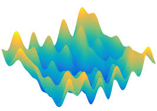
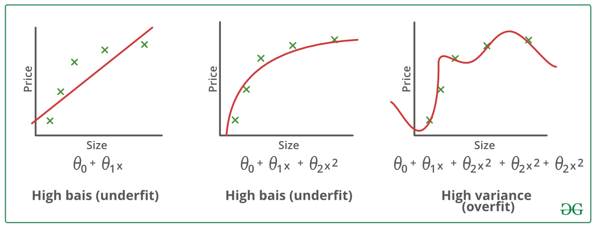

In lesson 2 of the fast-ai course discusses a variety of items. First, we will learn how to apply a model in production. Second, common pitfalls are being discussed. I will provide my econometric background on these pitfalls and how they relate to the statistics literature. Lastly, we will explore the inner working of most ML/DL algorithms by discussing the most elementary one: the logistic regression (LATER POST).

## Airplane classifier in production

After our model is trained, it can be used in practice. Often, this is done by creating a public API. This is often done by creating a website where users can submit their 'item' that they want to analyse. The website then predicts the class using the trained model and gives back this class (and corresponding probabilities) to the user. Let's see how this is done.

First, we export our model so that we can load it into our website.

```python
from fastai.vision import *

#learn corresponds to the best model of lesson 1
#learn.export('classifier.pkl')
```


```python
path = './'
img = open_image(path + 'A320_easyJet_new_livery_2015.jpeg')
img
```


```python
learn = load_learner(path, 'plane-classifier.pkl')

pred_class, _, _ = learn.predict(img)

print(pred_class)
```

    airbus

Although our model does not have the highest accuracy, we do manage to obtain the right class for this photo but note that a model that we randomly give back a class would also be right 50% of the time for any given photo...

To make this model available on a website you can use a service like [Render](render.com) or create a simple flask application. The fast-ai course provides several ways to put a model into production, e.g., [click here](https://course.fast.ai/deployment_render.html).

## Common pitfalls

### Introduction

Deep learning models consists of three fundamental parts: architecture, learning process and objection function. The pitfalls in lesson 2 mostly concern the learning process but note that these parts are not fully decoupled: they are all related.

Let's consider a function $$f$$ that maps an input matrix $$\boldsymbol{X}$$ to an output vector $$\boldsymbol{y}$$ using parameters $$\boldsymbol{\theta}$$, i.e.,

$$\boldsymbol{y} = f(\boldsymbol{\theta}; \boldsymbol{X}).$$

This type of problem of mappping an input to an output is called *supervised learning*. We want to have a function with parameters $$\boldsymbol{\theta}$$ that provides an output vector $$\hat{\boldsymbol{y}}$$ that most closely resembles the real output vector $$\boldsymbol{y}$$. The question raises, how to judge that our model is "good"? This is where the objective function comes in. This function, let's call it $$c$$, takes the predicted outputs $$\hat{\boldsymbol{y}}$$ and the real outputs $$\boldsymbol{y}$$ and tells us how "close" the values are. Most objective functions are defined on the interval between 0 and infinity and outputs a low number when the predicted and real values are close and a large value when they are far apart. An example of such a cost function is the mean-squared error function, i.e.,

$$c_\text{MSE}(\hat{\boldsymbol{y}}, \boldsymbol{y}) = \sum_i (\hat{y}_i - y_i)^2.$$

### Fundamental building blocks

Remember that $$\boldsymbol{y}$$ and $$\boldsymbol{X}$$ consistute the data we have and $$f$$ with parameters $$\boldsymbol{\theta}$$ and the objective function $$c$$ are the modelling choices. The three main questions for any deep/machine learning problem are:

1. What architecture $$f$$ works for our data?
2. How do we learn the parameters $$\boldsymbol{\theta}$$?
3. What defines a good model?

Lesson 2 of the fast-ai course mainly concerns problems with question 2: it is about the learning process. Almost all research and applications are based on so-called gradient-based optimisation. The comes from the idea that any function $$f$$ at point $$\boldsymbol{x}$$ can be written as the taylor series expansion, i.e.,

$$
\begin{equation}\label{taylor}\tag{1}
f(\boldsymbol{x}) = f(\boldsymbol{x}_0) + (\boldsymbol{x} - \boldsymbol{x}_0)^T\frac{\partial f(\boldsymbol{x}_0)}{\partial \boldsymbol{x}} + \frac{1}{2}(\boldsymbol{x} - \boldsymbol{x}_0)^T\frac{\partial^2 f(\boldsymbol{x}_0)}{\partial \boldsymbol{x}^2}(\boldsymbol{x} - \boldsymbol{x}_0) + \dots
\end{equation}
$$

---

Note: the link between this function $$f(\boldsymbol{x})$$ to our deep learning framework is that given data $$(\boldsymbol{X}, \boldsymbol{y})$$ we want to optimise the objection function $$c$$ using architecture $$f$$ by selecting the best parameters $$\boldsymbol{\theta}$$, i.e. we can write the correspondence

$$f(\boldsymbol{x}) \iff c(\boldsymbol{\theta}) = c(f(\boldsymbol{\theta}; \boldsymbol{X}), \boldsymbol{y}).$$

---

The idea of gradient-based optimisation is to "improve" our function $$f$$ by changing the values of $$\boldsymbol{x}$$ slightly at every step. If $$\boldsymbol{x}_0$$ is the current value then we compute the gradient $$\boldsymbol{g}$$ of $$f$$ at point $$\boldsymbol{x}_0$$ and take a small step in this direction, i.e., 

$$\boldsymbol{x}_1 = \boldsymbol{x}_0 - \epsilon \boldsymbol{g}.$$ If we fill this into the equation \eqref{taylor} we get

$$
\begin{equation}\label{true_learn}\tag{2}
f(\boldsymbol{x}_1) = f(\boldsymbol{x}_0) -\epsilon \boldsymbol{g}^T \boldsymbol{g} + \frac{1}{2}\epsilon^2\boldsymbol{g}^T\boldsymbol{H}\boldsymbol{g} + \dots,
\end{equation}
$$

where $$\boldsymbol{H} = \frac{\partial^2 f(\boldsymbol{x}_0)}{\partial \boldsymbol{x}^2}$$. The idea of gradient-based optimisation comes from the fact that for small values of $$\epsilon$$ the last term diminishes so that we can write

$$
\begin{equation}\label{approx_learn}\tag{3}
f(\boldsymbol{x}_1) \approx f(\boldsymbol{x}_0) -\epsilon \boldsymbol{g}^T \boldsymbol{g}.
\end{equation}
$$

Since $$\boldsymbol{g}^T \boldsymbol{g} \geq 0$$ by definition, we have that $$f$$ decreases when we take small steps along the gradient. Hence, we iteratively improve our objective function.

Jeremy Howard from the fast-ai course discusses some common pitfalls in learning the model parameters. I will discuss these pitfalls using the knowledge of the gradient-based optimisation that we just learnt.

### Learning rate too high

Although state-of-the-art models do not directly use the gradient to improve the objective function it is closely related. In our gradient-descent update step in \eqref{approx_learn} the learning rate refers to $$\epsilon$$. Before discussing why a high $$\epsilon$$ is bad, let's consider this figure.


In the plot on the right we see what happens when the learning rate is too high. The reason for this divergence is that our approximation only works when epsilon is small. If epsilon gets larger, the last term of equation \eqref{true_learn} and higher order terms generally are no longer close to zero. Hence, the true value $$f(\boldsymbol{x}_1)$$ might be larger than $$f(\boldsymbol{x}_0)$$ resulting in the behaviour seen in the right graph.

### Learning rate too low

If the learning rate is very low, then the gradient-based optimisation and its first-order linear approximation as in \eqref{approx_learn} accurately model the cost function $$c$$ close to the last parameter values $$\boldsymbol{\theta}$$. However, if the learning rate is too low, it will take many epochs to reach some kind of local minimum. Furthermore, if our function is not globally convex, we might never reach a good local minimum since we cannot escape the current path to the nearest local minimum.

### Too few epochs

One problem with too few epochs relates to the figure above. In the left graph, we see that when the learning rate is too low, then it takes many epochs to reach the minimum. Hence, if we set the number of epochs too low, we will not come close to this minimum.

Another problem with too few epochs arises when the objective function is no longer globally convex (which it never is!!). Consider the following figure which shows the "surface" of an objective function with two parameters, say $$\theta_0$$ and $$\theta_1$$.



If we start with randomly selected paramater values it is unlikely that we will ever reach the global minimum of the above objective function. There are ways to deal with this, such as more advanced learning algorithms instead of our basic gradient-descent algorithm in \eqref{approx_learn} (which still consistutes the basis of all these algorithms). However, if we only allow for a small number of epochs, the learning process does not have the opportunity to explore many regions of the objective surface.

### Too many epochs

Too many epochs is different from the other pitfalls we have seen so far. While the previous pitfalls relate to finding parameters $$\boldsymbol{\theta}$$ that minimises the objective function, too many epochs relates to a problem concerning the data.

When we train our model, we only have access to a limited (although often large) sample of observations. When we train our model on this training data with many epochs using a good learning algorithm we might be able to find a very good local minimum of the objective function. This would correspond to the right graph of the following figure



Our mean squared error is almost zero. Excellent! Now, what happens when we obtain a new sample and check the objective function under this new data? It is likely that the model on the middle now outperforms the model on the right, since it captures the real relationship between the input data $$\boldsymbol{X}$$ and the output $$\boldsymbol{y}$$ better than the overfitted model.

One remark related to modern model architectures: models are typically so large (in the number of parameters) that it is almost impossible to overfit the model as in the above figure. It would simply require too many epochs and a very good learning algorithm to ever overfit like this.

## Conclusion

We learnt how to export our model and call our model on a new observation to predicts its class. In the second part, we discussed a very high-level overview of machine/deep learning models and its fundamental building blocks, namely architecture, learning algorithm and objective function. Lastly, I discussed common pitfalls with regards to training a deep learning network.
